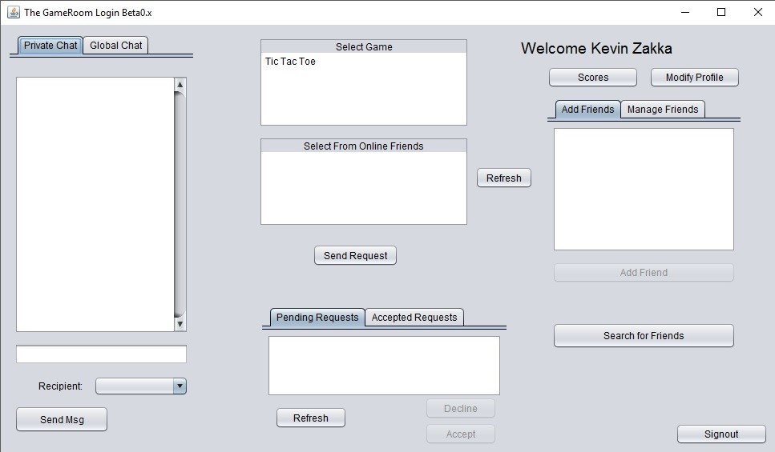
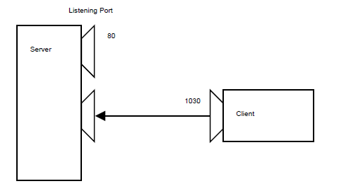
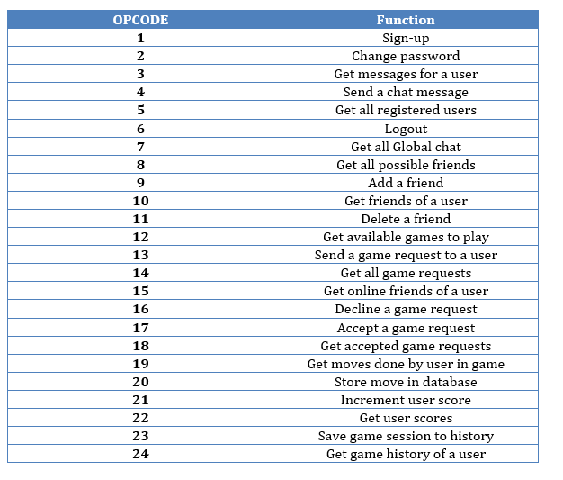

## The Game Room

This is an implementation of a "Steam-like" entertainment platform written entirely in Java. The **Game Room** provides the user with access to several multiplayer games through an online interface, where they can challenge their friends and play strategy games such as **Tic Tac Toe**.  

The Game Room is a project I worked on for my **Computer Networks** class. The objectives of this project were to become familiar with the Java programming language, get exposed to a *client-server* architecture, learn the basics of GUI design with Swing and gain experience with database design using mySQL.

  

## Files

    │---- src
    │     │---- client.java
    │     │---- gameRoom.java
    │     │---- server.java
    |     |---- sqlDB.java
    │
    |---- script.sql
    
`src` contains the 4 main files required for running **Game Room**. Run the sql script `script.sql` to create the tables necessary for the application in a database of your choice. Just make sure to update `sqlDB.java` with the correct database parameters (i.e. username, password) and edit `DB_URL` to reflect the correct name of your database.

## Implementation

The server part of the application is multithreaded. It runs on `localhost` and actively listens to connections on the port supplied by the command line. It consists of an `acceptClients()` method which loops in the background waiting for a client to connect. When one does, it forks a thread to accept the client in a thread of its own and instantiates a new socket for that client that listens on the same port. Note that the thread handling is asynchronously managed by use of an `ExecutorService`.

  

In each client handler, communication between client and server is done in the form of concatenated strings. The server identifies each command using an initial field we call **opcode**, inspired by the one used in assembly instructions.

  

